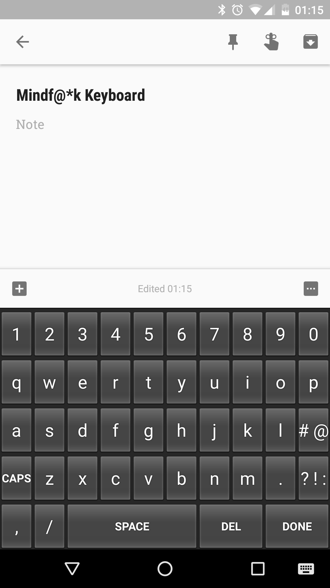
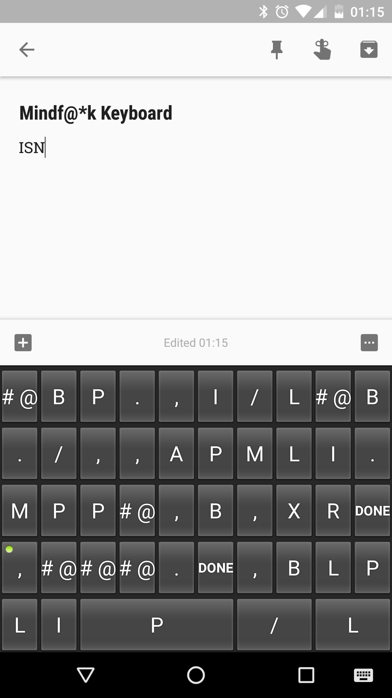
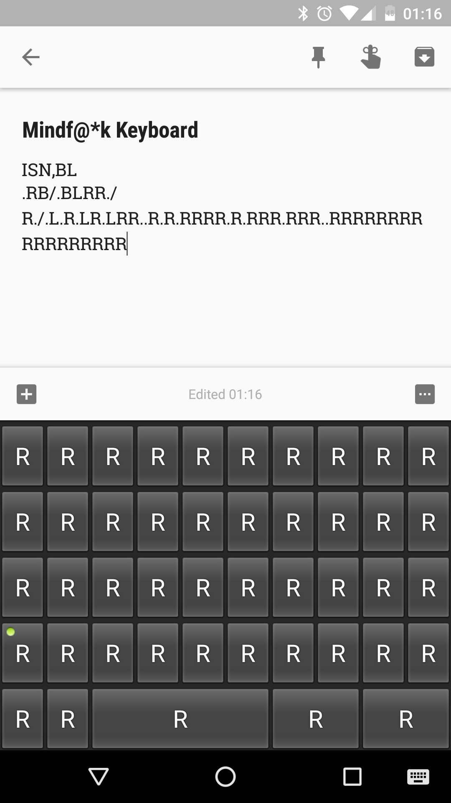

# Mindf@\*k Keyboard
Typing is hard. We all know how difficult it is at times to press the *right*
keys in the *right* combinations at the *right* times. It's a skill and it
takes a lot of effort and coordination to do it effectively.

That's why we made it harder.

## What is this?
This is a terrible soft-keyboard for Android devices, written in 8 hours for
[Terrible Hack Waterloo](http://terriblehack.website). On every keypress, the
the keyboard layout is randomized to make typing just so much more *fun*.

Submission [here](https://devpost.com/software/terriblekeyboard).

## IT'S NOT A BUG IT'S A FEATURE!!!1
When using this thing, you might notice that as you type, you wind up with
fewer and fewer available keys. This is because we are abusing Android... and
*Java sucks*.

Don't worry though, this software is supposed to absolutely useless! :grinning:

## Requirements
This awful keyboard requires a minimum of Android 4.3 (API 18).

You need either (a) a working Android device on 4.3+ or (b) the Android
emulator on an appropriate desktop system.

It is also probably a good idea not to have this app installed as the *only*
keyboard on your system.

## Caveats
If you need to reset the key layout to the default QWERTY (sorry DVORAK geeks!)
then you will need to temporarily change input methods to a different keyboard,
then change back.

## Credits

 * [Keefer Rourke](https://github.com/keeferrourke) - [https://krourke.org](https://krourke.org)
 * [Feilan Jiang](https://github.com/f-jiang)
 * [Bartlomiej Józef Chrząszcz](https://github.com/bartchr808)
 * [Eugene Wang](https://github.com/Kamagawa)

## License
This project is licensed under the WTFPLv2. Do what the fuck you want with this code. See LICENSE for details.

Some code is taken from the Android Open Source Project and falls under its respective licenses, as declared at the top of relevant java files.

## Screenshots

